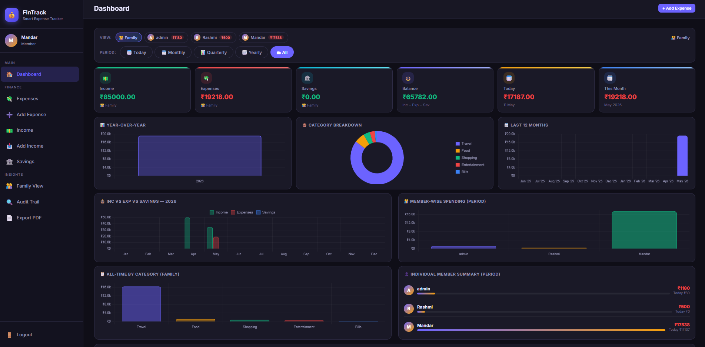

# FinTrack — Family Expense Tracker

A modern and secure Family Expense Tracker application built using Flask, SQLite, HTML5, CSS, and Vanilla JavaScript. FinTrack helps families efficiently manage expenses, income, savings goals, and financial analytics through an intuitive dashboard and responsive UI.

---

# Features

* Expense tracking and categorization
* Income management
* Savings goal tracking
* Interactive analytics dashboard
* Monthly spending insights
* Secure user authentication
* Admin and user role management
* Immutable audit logging
* Daily reminder email scheduling
* PDF report export support
* Responsive mobile-friendly design
* Dark mode glassmorphism UI

---

# Architecture Overview

```text
Browser  ──→  Flask Routes (app.py)
                 ├── Authentication
                 ├── Expense Management
                 ├── Income Management
                 ├── Savings Tracking
                 ├── Dashboard Analytics
                 ├── Audit Logging
                 └── Admin Panel
                          │
                     SQLAlchemy ORM
                          │
                       SQLite DB
                          │
              APScheduler Background Jobs
                          │
                    SMTP Email Service
```

---

# Frontend Stack

| Component         | Technology               |
| ----------------- | ------------------------ |
| Markup            | HTML5 + Jinja2           |
| Styling           | Vanilla CSS              |
| Interactivity     | Vanilla JavaScript       |
| Charts            | Chart.js                 |
| Typography        | Google Fonts – Inter     |
| Responsive Design | CSS Grid + Media Queries |

---

# Backend Stack

| Component      | Technology       |
| -------------- | ---------------- |
| Framework      | Flask            |
| ORM            | Flask-SQLAlchemy |
| Authentication | Werkzeug         |
| Sessions       | Flask Session    |
| Scheduler      | APScheduler      |
| Email Service  | smtplib          |
| PDF Export     | ReportLab        |
| Runtime        | Python 3.14      |

---

# Database Design

## SQLite Database

Database File:

```text
instance/expense_tracker.db
```

## Tables

| Table     | Purpose                  |
| --------- | ------------------------ |
| user      | Authentication and roles |
| expense   | Expense records          |
| income    | Income tracking          |
| saving    | Savings goals            |
| audit_log | Immutable audit history  |

---

# Security Features

* Password hashing using Werkzeug PBKDF2
* Session-based authentication
* Role-based access control
* Admin-only protected routes
* Immutable audit logging
* Secure SMTP authentication

---

# Analytics Dashboard

The dashboard provides:

* Category-wise expense analysis
* Monthly spending trends
* Income vs Expense comparison
* Savings progress visualization
* Budget tracking insights

Powered by Chart.js for interactive visual reporting.

---

# Email Automation

FinTrack uses APScheduler for automated daily reminders.

### Scheduled Tasks

* Expense reminders
* Savings alerts
* Budget notifications

### Email Technology

* Gmail SMTP
* STARTTLS Encryption
* App Password Authentication

---

# Installation

## Clone Repository

```bash
git clone https://github.com/yourusername/fintrack.git
cd fintrack
```

## Create Virtual Environment

```bash
python -m venv venv
```

## Activate Environment

### Windows

```bash
venv\Scripts\activate
```

### Linux / Mac

```bash
source venv/bin/activate
```

---

# Install Dependencies

```bash
pip install -r requirements.txt
```

---

# Run Application

```bash
python app.py
```

Application will start at:

```text
http://127.0.0.1:5000
```

---

# Project Structure

```text
fintrack/
│
├── app.py
├── requirements.txt
├── email_config.json
├── instance/
│   └── expense_tracker.db
│
├── templates/
│   ├── dashboard.html
│   ├── expenses.html
│   ├── income.html
│   ├── savings.html
│   ├── login.html
│   └── register.html
│
├── static/
│   ├── css/
│   │   └── styles.css
│   └── js/
│       └── dashboard.js
│
└── screenshots/
```

---

# Future Enhancements

* AI-based spending predictions
* Cloud synchronization
* Multi-family account support
* Mobile app integration
* REST API support
* PostgreSQL migration
* Docker deployment

---

# Technologies Intentionally Not Used

| Technology        | Reason                           |
| ----------------- | -------------------------------- |
| React/Vue         | Keep frontend lightweight        |
| Redis/Celery      | APScheduler sufficient           |
| PostgreSQL        | SQLite suitable for family scale |
| Docker/Kubernetes | Simple deployment preferred      |

---

# Screenshots

Add screenshots inside:

```text
/screenshots
```

Example:

```md

```

---

# License

This project is developed for educational and personal finance management purposes.

---

# Author

Mandar Patil

MBA AIML | AI & Full Stack Development Enthusiast | Banking Technology Professional
"# Fintrack" 
